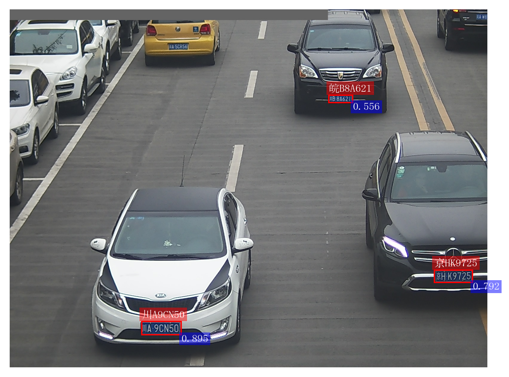
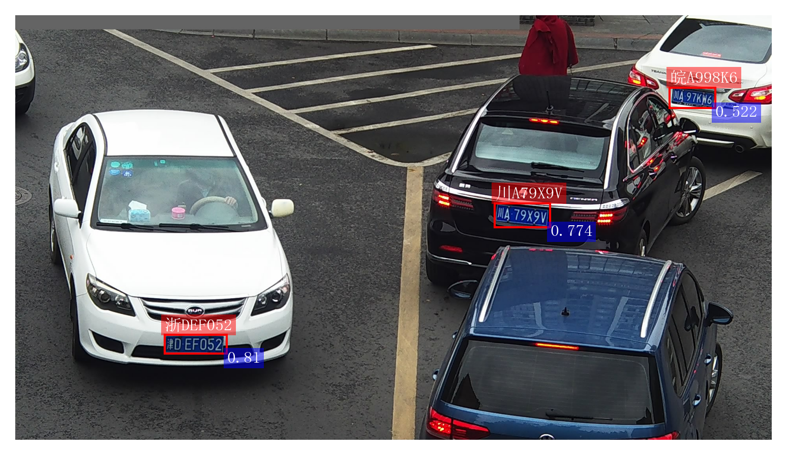
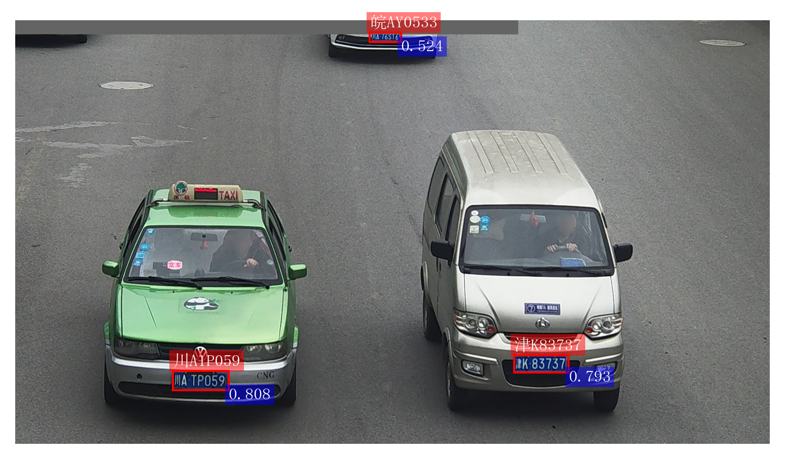
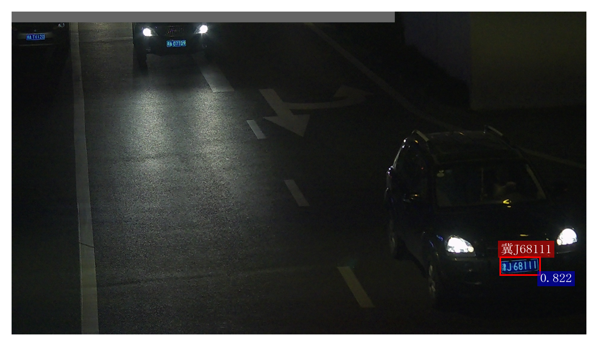
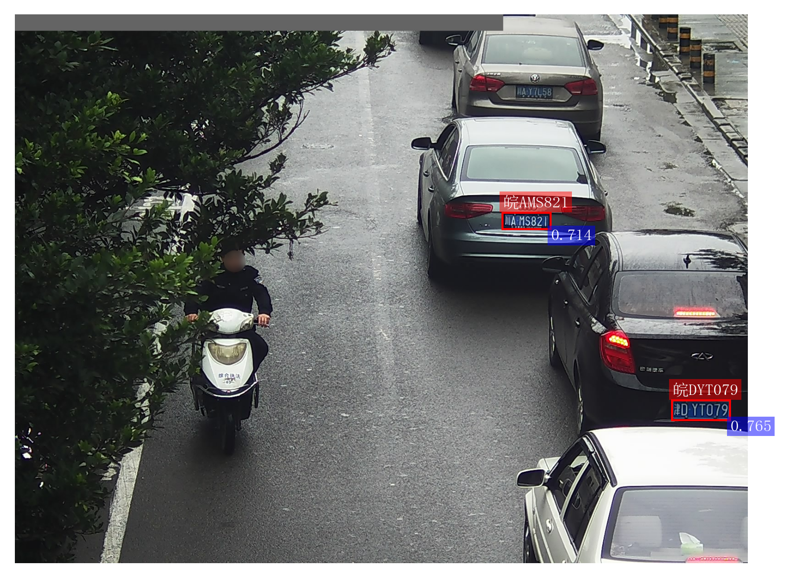
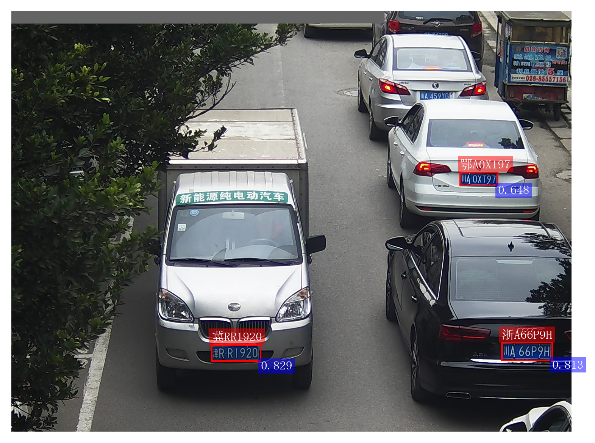
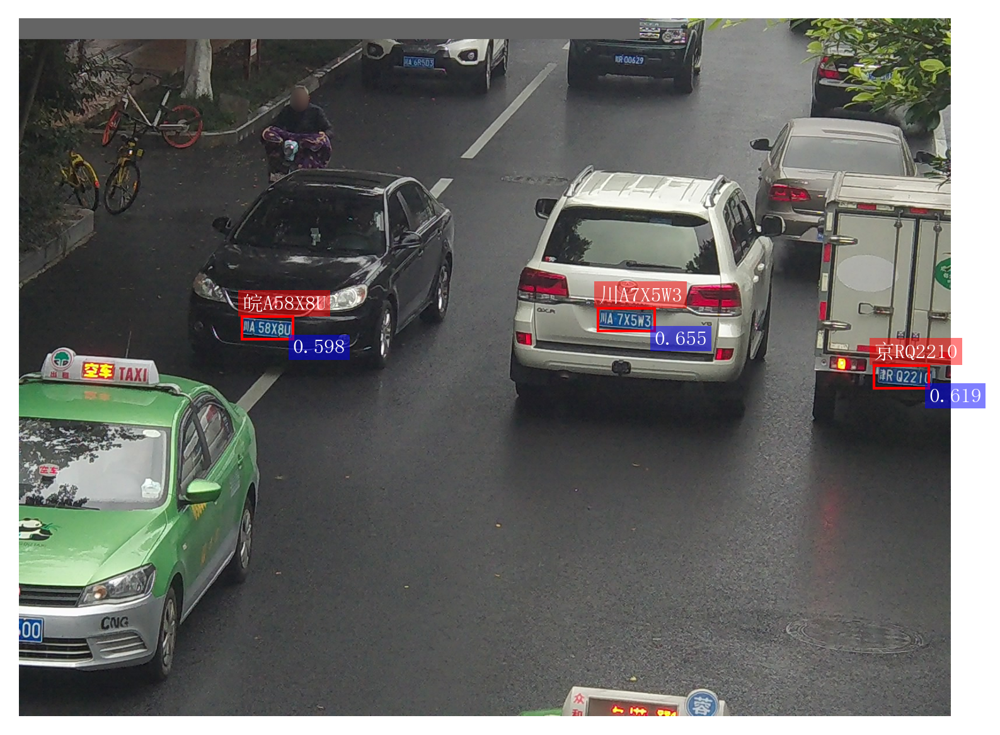
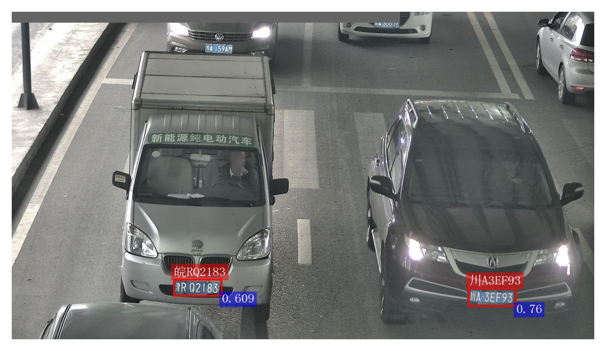
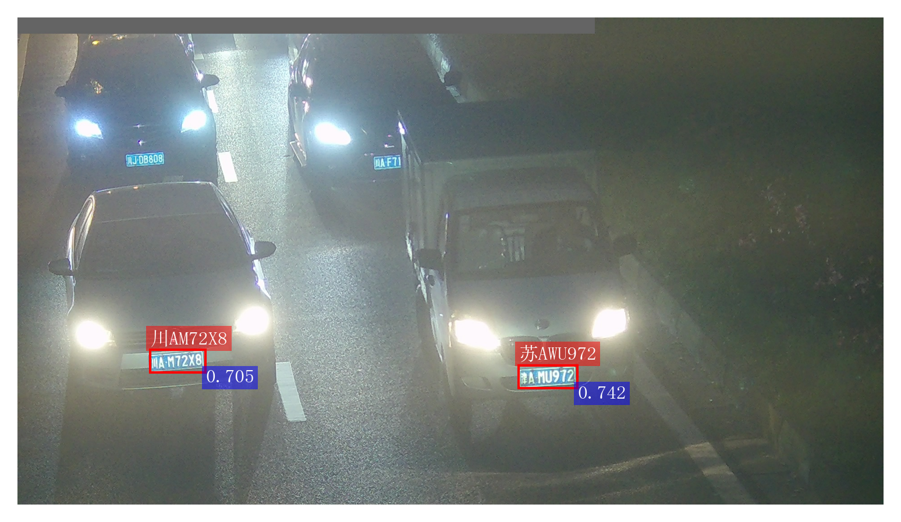

# (LITR) License Transformer: Unified End-to-End License Plate Detection and Recognition

PyTorch implementation for License Transformer (MTech project at IISc Bangalore)

[Read Report](./Thesis.pdf) | [View Poster](./Poster.pdf) | [View Presentation: Detection Transformer](./Detection%20Transformers.pdf)

## Performance

<table>
  <tr>
    <td>Model</td>
    <td>Input Shape</td>
    <td>Base</td>
    <td>DB</td>
    <td>FN</td>
    <td>Rotate</td>
    <td>Tilt</td>
    <td>Weather</td>
    <td>Challenge</td>
    <td>FPS</td>
    <td>Parameters (M)</td>
    <td>Model Weights</td>
  </tr>
  <tr>
    <td>LITR-R18</td>
    <td>640</td>
    <td>99.4</td>
    <td>86.7</td>
    <td>87.0</td>
    <td>93.5</td>
    <td>86.5</td>
    <td>97.9</td>
    <td>84.0</td>
    <td>50</td>
    <td>29.4</td>
    <td><a href="https://drive.google.com/file/d/1Qdz72qIb5dtp5aH4vB72K2rmF94Q6esj/view?usp=sharing">Downlaod</a></td>
  </tr>
  <tr>
    <td>LITR-R50</td>
    <td>640</td>
    <td>99.5</td>
    <td>89.0</td>
    <td>90.1</td>
    <td>93.6</td>
    <td>86.9</td>
    <td>98.5</td>
    <td>84.2</td>
    <td>41</td>
    <td>42.4</td>
    <td><a href="https://drive.google.com/file/d/1E5ZVF-eFkyGS3iyUHi2qlybGxFJV8LsZ/view?usp=sharing">Downlaod</a></td>
  </tr>
</table>

Comment: FPS is the number of images processed by model per second.

## Predictions

LITR-R50 outputs:

<table style="width: 100%;">
  <tr>
    <td></td>
    <td></td>
    <td></td>
  </tr>
  <tr>
    <td></td>
    <td></td>
    <td></td>
  </tr>
  <tr>
    <td></td>
    <td></td>
    <td></td>
  </tr>
</table>

LITR-R50 output over video file:

Comment: [Visit](https://drive.google.com/file/d/1bm_mrDbdLNlUI8HJSZJU6Y9CFSptI9wb/view?usp=sharing) to view the full .mp4 output.
